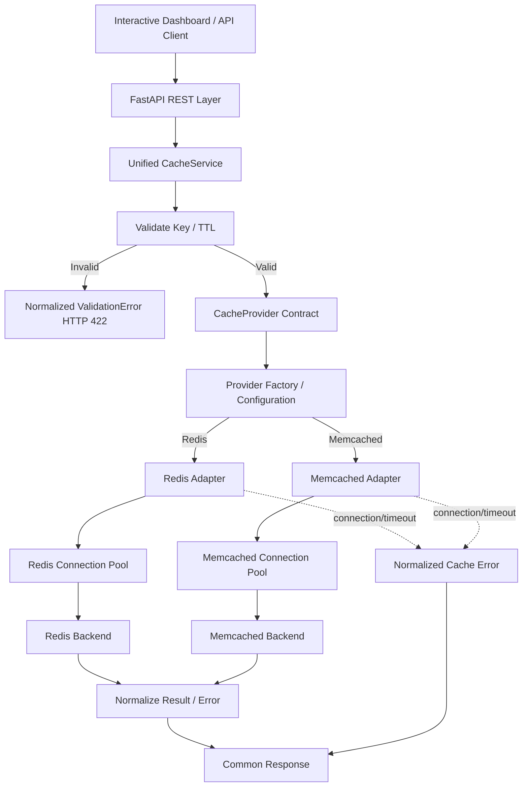

# Pluggable Caching Abstraction Layer

A configuration-driven caching abstraction layer in Python providing a unified, portable contract over interchangeable cache backends (**Redis** and **Memcached**), accompanied by an interactive technical demonstration web dashboard.

---

## 🚀 Value Proposition

Applications often suffer from vendor lock-in when calling backend-specific cache APIs directly. Switching from Redis to Memcached (or vice versa) frequently demands widespread code rewrites, error handling changes, and serialization adjustments.

This library solves the problem by providing:
- **One Stable Contract**: Application code interacts with a single `CacheService` / `CacheProvider` interface (`get`, `get_with_status`, `exists`, `set`, `delete`, `clear`, `health_check`).
- **Zero Application Code Changes**: Switch between Redis and Memcached via configuration without changing application-facing cache calls.
- **Disambiguated Hit/Miss Semantics**: Authoritative `get_with_status()` and `exists()` methods explicitly distinguishing a true cache miss (`HTTP 404`) from a cached `None` (`HTTP 200 {"value": null}`).
- **Normalized Reliability Layer**: Unified exception hierarchy (`CacheConnectionError`, `CacheTimeoutError`, `CacheValidationError`, etc.) mapping backend-specific errors into predictable domain exceptions.
- **Portable Serialization**: Type-preserving, vendor-neutral serialization handling primitives (`str`, `int`, `float`, `bool`, `None`, `bytes`) and JSON-serializable complex data structures.
- **Namespace-Safe Clear**: Redis utilizes `SCAN` pattern batch deletion and Memcached utilizes epoch versioning (`_ns_ver:<ns>`) so clearing a namespace never wipes out data from unrelated applications.
- **TTL Portability**: Uniform relative TTL semantics with automatic Unix epoch translation for Memcached durations $> 30$ days (`2,592,000s`).
- **Configuration-Driven Factory**: Instantiate providers and services via environment variables (`CACHE_BACKEND`, `REDIS_HOST`, `MEMCACHED_HOST`, etc.) or dictionary configs.
- **REST API & Concurrency-Safe Service Management**: Built-in FastAPI server with reference-counted request draining on dynamic backend switches.
- **Interactive Web Dashboard**: High-contrast React + Vite frontend for live judge exploration, semantic testing, architecture flow visualization, and guided automated demonstrations.

---

## 🏛️ Architecture & System Flow



---

## 📁 Repository Structure

```text
├── cache_layer/
│   ├── __init__.py           # Public package exports
│   ├── api.py                # FastAPI REST server & ServiceManager
│   ├── config.py             # CacheConfig, RedisConfig, MemcachedConfig
│   ├── contract.py           # CacheProvider ABC interface
│   ├── exceptions.py         # Normalized exception hierarchy
│   ├── factory.py            # ProviderFactory (config-driven instantiation)
│   ├── metrics.py            # Lightweight MetricsCollector (p50/p95 percentiles)
│   ├── serializer.py         # PortableJsonSerializer with type preservation
│   ├── validation.py         # Key, TTL, and namespace validation engine
│   ├── service.py            # CacheService coordinator
│   └── adapters/
│       ├── __init__.py
│       ├── redis_adapter.py      # Pooled Redis client adapter
│       └── memcached_adapter.py  # Pooled pymemcache adapter
├── frontend/                 # Interactive React + Vite + TypeScript web dashboard
│   ├── src/
│   │   ├── api/cacheApi.ts   # Centralized typed API client
│   │   ├── components/       # Header, Switcher, Visualizer, Operations, Demos
│   │   ├── types/index.ts    # TypeScript interfaces
│   │   ├── App.tsx           # Dashboard coordinator
│   │   └── index.css         # High-contrast technical design system
│   ├── package.json
│   ├── vite.config.ts
│   └── index.html
├── examples/
│   └── ecommerce_service.py  # Real-world e-commerce catalog service
├── tests/
│   ├── test_api.py               # REST API & concurrency draining tests
│   ├── test_cache_service.py     # End-to-end service & interchangeability tests
│   ├── test_config_and_factory.py# Configuration & ProviderFactory tests
│   ├── test_contract_suite.py    # Universal contract test suite for all adapters
│   ├── test_ecommerce_caching.py # Real-world e-commerce cache-aside tests
│   ├── test_exceptions.py        # Exception hierarchy tests
│   ├── test_integration_real_backends.py # Live Redis & Memcached integration tests
│   ├── test_memcached_adapter.py # Memcached adapter unit & error injection tests
│   ├── test_metrics_and_benchmark.py # Metrics calculation & percentiles tests
│   ├── test_redis_adapter.py     # Redis adapter unit & error injection tests
│   ├── test_serializer.py        # Portable serializer tests
│   └── test_validation.py        # Key/TTL validation tests
├── benchmark.py              # Reproducible 1,000-op benchmark harness
├── demo.py                   # Interactive 5-step demo harness
├── ecommerce_demo.py         # Real-world e-commerce catalog demo
├── docker-compose.yml        # Docker Compose configuration (Redis + Memcached)
├── Dockerfile                # Test runner container definition
├── requirements.txt          # Explicit package dependencies
├── pytest.ini                # Pytest configuration & markers
├── ARCHITECTURE.md           # Technical baseline & architecture specifications
├── PRD.md                    # Product requirements document
├── PROGRESS.md               # Task tracking & decisions log
└── README.md                 # Project documentation
```

---

## 🖥️ Running the Interactive Web Dashboard

To launch the full interactive web application for judging and live exploration:

### 1. Start the FastAPI Backend Server
```bash
# In project root:
uvicorn cache_layer.api:app --reload --port 8000
```

### 2. Start the Frontend Application
```bash
# In frontend directory:
cd frontend
npm install
npm run dev
```
Open **`http://localhost:5173`** in your browser.

---

## 🐳 Docker Setup

### Option 1: Start Redis and Memcached Daemons (For Local Testing)
```bash
docker compose up -d redis memcached
```

### Option 2: Run Full Test Suite in Container (Zero Host Dependencies)
```bash
docker compose up --build app-test
```

---

## 💻 Python Usage Examples

### 1. Configuration-Driven Initialization via `ProviderFactory`

```python
from cache_layer import ProviderFactory, CacheConfig

# Create directly from environment variables:
# export CACHE_BACKEND=redis
# export CACHE_NAMESPACE=my_service
cache = ProviderFactory.create_service()

# Or create from explicit config dictionary:
config = {
    "backend": "memcached",
    "namespace": "my_service",
    "memcached": {"host": "localhost", "port": 11211}
}
cache = ProviderFactory.create_service(config)
```

### 2. Basic CRUD, Cache Hit/Miss Disambiguation, and TTL

```python
with cache:
    # Store string with 1-hour TTL
    cache.set("session_id", "abc-123", ttl=3600)

    # Store complex JSON dict
    cache.set("user:101:profile", {
        "name": "Sarah Connor",
        "roles": ["admin"],
        "active": True
    }, ttl=600)

    # Store explicit None (Cached None)
    cache.set("optional_flag", None)

    # Check existence
    if cache.exists("optional_flag"):
        print("Flag exists in cache!")

    # Disambiguate Cache Miss vs Cached None
    is_hit, val = cache.get_with_status("optional_flag")
    print(f"Hit: {is_hit}, Value: {val}")  # Hit: True, Value: None

    # Delete key
    cache.delete("session_id")
```

### 3. Namespace-Safe Clearing

```python
# Clears ONLY keys belonging to 'my_service', preserving all other namespaces
cache.clear()
```

### 4. Normalized Error Handling

```python
from cache_layer import (
    CacheConnectionError,
    CacheTimeoutError,
    CacheValidationError,
    CacheError
)

try:
    cache.get("invalid key with spaces")
except CacheValidationError as e:
    print(f"Validation error: {e}")
except CacheConnectionError as e:
    print(f"Connection error: {e}")
except CacheTimeoutError as e:
    print(f"Timeout error: {e}")
except CacheError as e:
    print(f"General cache error: {e}")
```

---

## 🌐 REST API Endpoints

| Method | Endpoint | Description |
| :--- | :--- | :--- |
| `GET` | `/health` | Backend health check and latency report |
| `GET` | `/cache/info` | Current active backend and namespace info |
| `GET` | `/cache/metrics` | Real-time operation counts, hit ratio, and latency percentiles |
| `POST`| `/cache/metrics/reset` | Reset telemetry and latency buffers |
| `GET` | `/cache/{key}` | Retrieve cached value (`404` on miss, `200` on cached value/None) |
| `PUT` | `/cache/{key}` | Store value with optional `ttl` |
| `DELETE` | `/cache/{key}` | Delete specific key |
| `DELETE` | `/cache` | Clear configured namespace |
| `POST` | `/cache/switch` | Dynamically switch backend provider with request draining |
| `GET` | `/products/{product_id}` | E-commerce catalog retrieval with cache-aside |
| `PUT` | `/products/{product_id}/price` | Update product price and invalidate cache |

---

## 🎬 Running Demonstrations & Benchmarks

```bash
# Core 5-step demonstration harness
python demo.py

# Real-world e-commerce product catalog demonstration
python ecommerce_demo.py

# Isolated in-memory abstraction & instrumentation benchmark
python benchmark.py

# Live network daemon benchmark (against live Redis on 6379 / Memcached on 11211)
python benchmark.py --live
```

---

## 🧪 Running Tests

Execute the automated test suite:

```bash
# Run all 50 unit, contract, and e-commerce tests
python -m pytest -v

# Run with statement coverage report (85% coverage across cache_layer)
python -m pytest --cov=cache_layer -v

# Run live real-backend integration tests (when Redis/Memcached are active)
python -m pytest tests/test_integration_real_backends.py -v
```

---

## 📜 License

MIT License.
