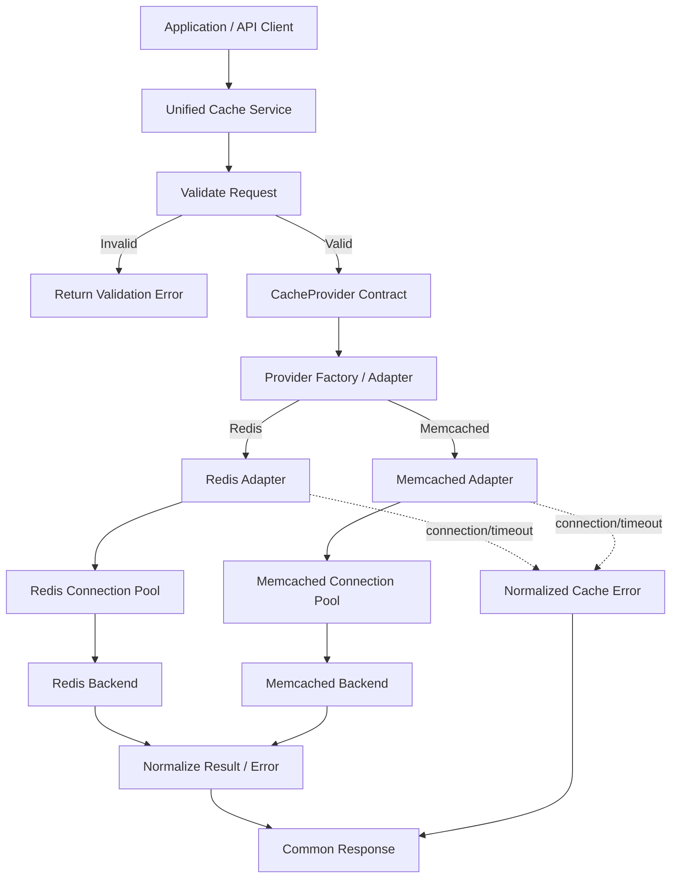

# Pluggable Caching Abstraction Layer

A production-grade, configuration-driven caching abstraction layer in Python providing a unified, portable contract over interchangeable cache backends (**Redis** and **Memcached**).

---

## 🚀 Value Proposition

Applications often suffer from vendor lock-in when calling backend-specific cache APIs directly. Switching from Redis to Memcached (or vice versa) frequently demands widespread code rewrites, error handling changes, and serialization adjustments.

This library solves the problem by providing:
- **One Stable Contract**: Application code interacts with a single `CacheService` / `CacheProvider` interface (`get`, `set`, `delete`, `clear`, `health_check`).
- **Zero Application Code Changes**: Switch between Redis and Memcached via configuration without changing application-facing cache calls.
- **Normalized Reliability Layer**: Unified exception hierarchy (`CacheConnectionError`, `CacheTimeoutError`, `CacheValidationError`, etc.) mapping backend-specific errors into predictable domain exceptions.
- **Portable Serialization**: Type-preserving, vendor-neutral serialization handling primitives (`str`, `int`, `float`, `bool`, `None`, `bytes`) and JSON-serializable complex data structures.
- **Connection Pooling & Health Checks**: Production-ready connection pooling and latency-aware health checks for both backends.

---

## 🏛️ Architecture & System Flow



---

## 📁 Repository Structure

```text
├── cache_layer/
│   ├── __init__.py           # Public exports
│   ├── contract.py           # CacheProvider ABC interface
│   ├── exceptions.py         # Normalized exception hierarchy
│   ├── serializer.py         # PortableJsonSerializer with type preservation
│   ├── validation.py         # Key, TTL, and namespace validation engine
│   ├── service.py            # CacheService coordinator
│   └── adapters/
│       ├── __init__.py
│       ├── redis_adapter.py      # Pooled Redis client adapter
│       └── memcached_adapter.py  # Pooled pymemcache adapter
├── tests/
│   ├── test_cache_service.py     # End-to-end integration & interchangeability tests
│   ├── test_exceptions.py        # Exception hierarchy tests
│   ├── test_memcached_adapter.py # Memcached adapter unit & error injection tests
│   ├── test_redis_adapter.py     # Redis adapter unit & error injection tests
│   ├── test_serializer.py        # Portable serializer tests
│   └── test_validation.py        # Key/TTL validation tests
├── ARCHITECTURE.md           # Technical baseline & architecture specifications
├── PRD.md                    # Product requirements document
├── PROGRESS.md               # Task tracking & decisions log
├── .gitignore                # Git ignore patterns
└── README.md                 # Project documentation
```

---

## 📦 Installation & Requirements

### Prerequisites
- Python 3.9+
- Redis Server (optional for local live backend testing)
- Memcached Server (optional for local live backend testing)

### Dependencies
Install the required dependencies:

```bash
pip install redis pymemcache pytest
```

---

## 💻 Usage Examples

### 1. Basic Usage with Redis

```python
from cache_layer import CacheService, RedisAdapter

# Initialize Redis adapter with connection pooling
redis_adapter = RedisAdapter(
    host="localhost",
    port=6379,
    db=0,
    socket_timeout=2.0
)

# Initialize CacheService
with CacheService(provider=redis_adapter, namespace="app_v1") as cache:
    # Set with TTL (300 seconds)
    cache.set("user:101:profile", {"name": "Alice", "role": "admin"}, ttl=300)
    
    # Get value
    profile = cache.get("user:101:profile")
    print(profile)  # {'name': 'Alice', 'role': 'admin'}
    
    # Delete key
    cache.delete("user:101:profile")
```

### 2. Switching to Memcached (Identical Application Calls)

```python
from cache_layer import CacheService, MemcachedAdapter

# Initialize Memcached adapter with connection pooling
memcached_adapter = MemcachedAdapter(
    host="localhost",
    port=11211,
    connect_timeout=2.0,
    timeout=2.0
)

# The exact same CacheService API calls work without any changes
with CacheService(provider=memcached_adapter, namespace="app_v1") as cache:
    cache.set("user:101:profile", {"name": "Alice", "role": "admin"}, ttl=300)
    profile = cache.get("user:101:profile")
    print(profile)
    cache.delete("user:101:profile")
```

### 3. Health Checks

```python
health = cache.health_check()
print(health)
# Output:
# {
#     "status": "healthy",
#     "provider": "redis",
#     "latency_ms": 1.25,
#     "details": {"host": "localhost", "port": 6379, "db": 0}
# }
```

### 4. Normalized Error Handling

```python
from cache_layer import (
    CacheConnectionError,
    CacheTimeoutError,
    CacheValidationError,
    CacheError
)

try:
    cache.get("invalid key with spaces")
except CacheValidationError as e:
    print(f"Validation failed: {e}")
except CacheConnectionError as e:
    print(f"Connection failed: {e}")
except CacheTimeoutError as e:
    print(f"Operation timed out: {e}")
except CacheError as e:
    print(f"General cache error: {e}")
```

---

## 🧪 Running Tests

Execute the comprehensive test suite with `pytest`:

```bash
python -m pytest -v
```

---

## 📜 License

MIT License.
